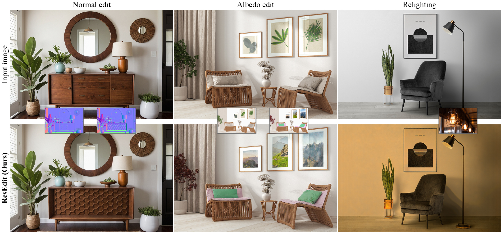

# ResEdit: Residual embeddings for precise generative image editing

<a href="https://arxiv.org/abs/2606.16457"></a> <a href="https://diglib.eg.org/handle/10.1111/cgf70551"></a> <a href="https://johnberg1.github.io/resedit/"></a>

> Official implementation of **ResEdit: Residual embeddings for precise generative image editing**, published in *Computer Graphics Forum*, Volume 45 (2026), and presented at EGSR 2026.

<p align="center">

<br>
ResEdit enables high-fidelity generative editing by isolating image identity in a learned residual image embedding. Unlike traditional inversion methods that struggle with "baked-in" condition features, ResEdit explicitly separates identity from physical conditions, enabling intrinsic-space manipulation of geometry and materials, as well as reference-based relighting. By shifting the burden of reconstruction from the noise latent to this dedicated residual channel, ResEdit balances identity preservation with responsive editability without requiring model surgery.
</p>

## Updates

**15.07.2026**: We released the code.

**01.07.2026**: ResEdit was published in *Computer Graphics Forum*, Volume 45 (2026).

## Getting Started

### Prerequisites

1. Create and activate the conda environment:

   ```bash
   conda env create -f environment.yml -y
   conda activate resedit
   ```

2. [Stable Diffusion 3.5 Medium](https://huggingface.co/stabilityai/stable-diffusion-3.5-medium) is a gated model. Request access on Hugging Face, then authenticate from the terminal:

   ```bash
   hf auth login
   ```

### Pretrained models

Pretrained models are available on [Hugging Face](https://huggingface.co/johnberg/resedit). The demo downloads the required checkpoints automatically; no separate download is required.

## Running the demo

To launch the demo:

```bash
python demo.py
```

### Workflow

- Upload the image you want to edit.
- Upload an original condition and its edited version (e.g., an albedo map). Example inputs are provided in [`assets/examples/`](assets/examples/).
- Leave the other image inputs blank.
- Select the appropriate adversarial target from the dropdown menu. For example, select "albedo" for an albedo edit.
- Adjust the optimization parameters (e.g., number of steps and adversarial weight) and inversion method (`exact` or `DDIM`), then run the demo.

## Acknowledgements

This repository builds on code from [RGB↔X](https://zheng95z.github.io/publications/rgbx24.html) and [IntrinsicEdit](https://intrinsic-edit.github.io/).

## Citation

```bibtex
@article{10.1111:cgf.70551,
  journal = {Computer Graphics Forum},
  title = {{ResEdit: Residual embeddings for precise generative image editing}},
  author = {Baykal, Canberk and Deschaintre, Valentin and Hold-Geoffroy, Yannick and Fischer, Michael and Frühstück, Anna and Öztireli, Cengiz and Georgiev, Iliyan},
  year = {2026},
  publisher = {The Eurographics Association and John Wiley & Sons Ltd.},
  ISSN = {1467-8659},
  DOI = {10.1111/cgf.70551}
}
```
